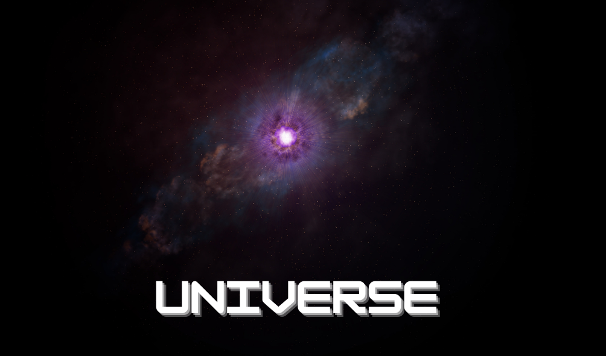

  

---

### 🌎 Sobre

O projeto "Universe" é um site focado no nosso maravilhoso universo. Traz imagens ou vídeos do dia, utilizando a API da NASA. 

### 🗂 Tarefas

 - [x] Escolher Layout (15/11/2020);
  
 - [x] Montar o planejamento (16 - 17/11/2020)

 - [ ] Montar a estrutura inicial -> (18 - 27/11/2020);
   - [ ] Criar HTML (18 - 20/11/2020); 
   - [ ] Criar CSS (21 - 23/11/2020);
   - [ ] Criar JS (24 -27/11/2020);

 - [ ] Implementar API da NASA (1 - 3/12/2020);
  
 - [ ] Implementar fullscreen mode (4 - 7/12/2020);

 - [ ] Implementar download da imagem (7 - 10/12/2020);

 - [ ] Implementar troca de tela - datas (11 - 14/12/2020);

 - [ ] Implementar pesquisa (15 - 18/12/2020);

 - [ ] Implementar botão de compartilhar (19 - 20/12/2020);

 - [ ] Fazer testes de uso e simular cenários (21 -24/12/2020);

 - [ ] Refatorar o código (26 - 29/12/2020);

 - [ ] Documentar (30 - 31/12/2020);

